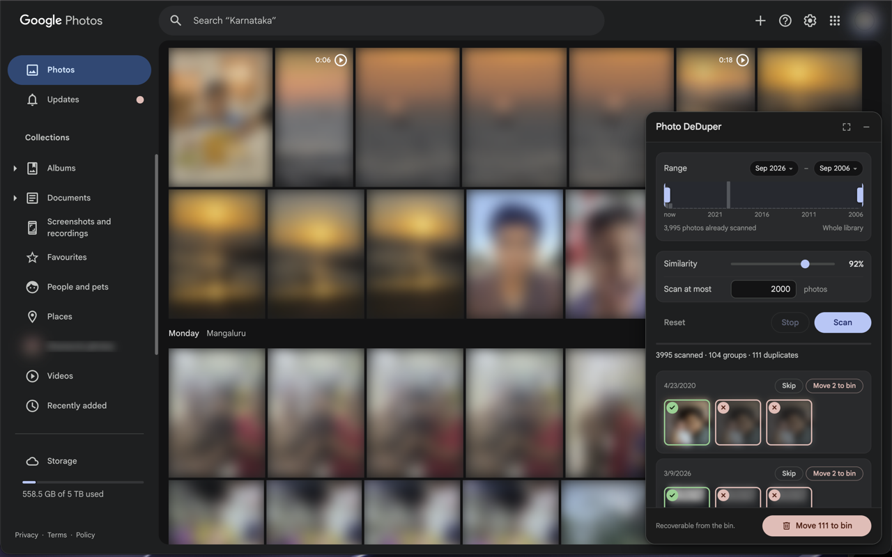

# Photo DeDuper

A Chrome extension that scans the Google Photos library of whoever is signed in,
finds visually duplicate photos, and moves the ones you choose to the bin.

## Features

- **Fast** — a small perceptual hash of every photo is kept in a local IndexedDB, so a
  library is scanned once and regrouping after that is instant.
- **Scales** — built for libraries in the tens of thousands. Photos are listed/scanned in bulk in background. So no scrolling to scan all photos.
- **Tunable** — one similarity slider, 70% to 100%. Set it to 100% to match only
  exact copies, or ease it down to catch crops, re-saves and re-compressions of
  the same shot.
- **Recoverable** — Deleting moves photos to the Google Photos Trashbin where they sit for a month, and Undo puts the last run straight back.

Independent: not made by, endorsed by, or affiliated with Google. Named "Google
Photos DeDuper" until the store listing was prepared — the store forbids a name
that implies affiliation. Listing copy is in [STORE.md](STORE.md); build the
upload zip with `tools/package.sh`.



_The panel docked over the library: range, similarity, and each duplicate group
with its keeper ringed green. Photos are blurred in every screenshot here — a
real library is somebody's family, so `src/dev-shot.js` blurs the page before
anything is captured._

## Why it works this way

The Google Photos Library API has **no delete method** — `mediaItems` exposes
list/get/search/batchCreate/patch, and `albums.batchRemoveMediaItems` only
unlinks items from an album your own app created. So any deduper has to drive
the photos.google.com UI. Everything below was verified against the live site.

| What             | Finding                                                                                                                                                                                                                                                                              |
| ---------------- | ------------------------------------------------------------------------------------------------------------------------------------------------------------------------------------------------------------------------------------------------------------------------------------ |
| Tile             | `a[href*="/photo/"]` — `./photo/<id>` in the main library, `./documents/<album>/photo/<id>` in album and Screenshots views; id is the segment after `/photo/`                                                                                                                        |
| Capture date     | in the tile's `aria-label` (`"Photo – Portrait – 24 Aug 2025, 12:34:56"`) — free, no extra request                                                                                                                                                                                   |
| Thumbnail        | `background-image` on a `[data-latest-bg]` descendant, served from `photos.fife.usercontent.google.com`                                                                                                                                                                              |
| Listing          | the page's own timeline RPC (`lcxiM`) returns 500 items per request, newest first, with media key, dedup key, capture time, dimensions and a thumbnail base URL; a timestamp argument starts the listing at that date                                                                |
| Thumbnail pixels | readable by a **credentialed** fetch from the content script (`credentials: "include"`, ~1.2KB at 32px). `crossOrigin="anonymous"` gets a transparent placeholder and a cookieless service-worker fetch gets a sign-in page, which is what the earlier "not readable" verdict tested |
| Grid             | virtualised — ~130 tiles live, ~108 dropped per 6000px of scroll                                                                                                                                                                                                                     |
| Scroll container | a `c-wiz` in the main library, a plain `div[jsname]` in album views — found by walking up from a tile, not by tag                                                                                                                                                                    |
| Selection        | per-tile `[role="checkbox"]`; date headers use the same role, labelled `"Select all …"`                                                                                                                                                                                              |
| Deletion         | the page's own `batchexecute` RPC (`XwAOJf`), which takes each photo's dedup key rather than the `/photo/<id>` media key; the media-info RPC (`VrseUb`) maps one to the other                                                                                                        |
| Input            | **scripted clicks are ignored** — `.click()` and full synthetic pointer/mouse sequences both fail, including on the always-visible "Clear selection" button — which is why deletion talks to the RPC instead of the page                                                             |

Scanning never touches the grid: the library is listed through the same
`batchexecute` RPC the page uses to fill its timeline, 500 items a request, and
each item's thumbnail is fetched at 32px with the session cookies and hashed
(dHash, 64-bit) in the content script. No scrolling, no screenshots, and the tab
does not need to be visible. The server spends ~250–600ms resizing each
thumbnail whatever the concurrency, so throughput is bounded by how many
requests are in flight: ~150 photos/s at 128, or roughly 25 minutes for 200k.

Deletion sends the same request Google Photos sends when you click "Move to
bin", from the content script with the page's own session: up to 250 photos per
request, and the reply names each photo it binned, which is what the extension
counts. It is pinned to Google's private protocol; the request shapes come from
[xob0t/Google-Photos-Toolkit](https://github.com/xob0t/Google-Photos-Toolkit)
(MIT), which has shipped the same ones since 2024. If the shape ever changes the
result is a skipped photo, never a wrongly binned one.

## Install

Unpacked only. There is no store listing to install from.

1. `chrome://extensions` → enable **Developer mode**
2. **Load unpacked** → select this folder
3. Open <https://photos.google.com> and click the extension's toolbar icon to
   show or hide the panel

## First run — do this before pointing it at anything large

Verified end to end on a live album: scan, dry run, and a real delete. Still
worth walking through in this order on anything you have not scanned before:

1. Open a small album (not the main library), set **Scan at most** to `50`, Scan.
2. Check the panel reports a sane number of groups and does not abort with
   "every tile hashed identically". Spot-check that the photos inside a group
   really do look alike.
3. **Dry run** — confirm the count it reports matches what you selected.
4. Let it do one live delete on a single group, then check the Bin.

Only then raise the cap.

## Use

1. **Scan** — walks the grid, hashing each thumbnail (dHash, 64-bit) and writing
   it to IndexedDB as it goes. Start with the default cap of 2000 rather than the
   whole library. **The tab has to stay visible**: Google Photos stops rendering
   tiles when it is hidden, and the scan will report that it has paused.
2. Adjust **Similarity** to regroup — 100% is byte-identical thumbnails, lower
   values catch recompressions and burst shots.
3. Review the groups. Green is the keeper (oldest by default). Click a photo to
   make it the group's keeper; click the badge on a thumbnail to flip that
   single item between keep and bin.
   **Hover a thumbnail** to see the photo large (up to 1200px) with its capture
   time, so you can tell two near-identical shots apart before deleting one. The
   preview works because the thumbnail URL's size segment is rewritable —
   `=w144-h193-no` becomes `=w1200-h1200-no` and returns a genuinely larger
   image rather than an upscale.

   The minimise button collapses the panel to its title bar.

4. **Dry run** first — it reports what it would delete and touches nothing.
5. **Move selected to bin** — click it twice (the button arms itself for five
   seconds rather than opening a dialog; a content script's native `confirm()`
   blocks the whole renderer). It bins 250 photos per request and only counts a
   photo once Google's reply names it. Items land in the Google Photos bin and
   stay recoverable there for as long as Google keeps them. Anything not
   confirmed stays selected, so clicking again carries on.

**Scope** is whatever grid you are on. The main library, an album, the
`Screenshots and recordings` view, or a search result all work — open the view
first, then scan. On a ~100k-photo library a full pass is an hours-long session,
which is why scoping to an album or raising the cap gradually is the better way
in.

## Layout

Plain content scripts, no build step; `manifest.json` lists them in load order
and each registers itself on `window.GPDD`.

- `src/lib/` — no DOM: `store` (IndexedDB), `hash` (dHash), `grouping`,
  `api` (batchexecute calls: bin, restore, media info), `scanner` (listing plus
  thumbnail hashing), `selectors` (the few Google Photos DOM facts still used).
- `src/ui/` — the panel, one component per file under `window.GPDD.ui`:
  `styles` (design tokens and the shared chrome, controls and buttons) and
  `icons` (inline SVG), `range` (month slider), `preview` (the hover preview),
  `results` (group cards, paging, selection), `panel` (template, `mount()`,
  status setters). Each of `range`, `preview` and `results` carries its own
  markup and CSS next to its code; `panel` concatenates the four stylesheets.
- `src/content.js` — wiring: state, the scan flow and the delete flow.
- `src/background.js` — extension reload and the toolbar button only.

## Reloading during development

Chrome only picks up edits to an unpacked extension after a reload on
`chrome://extensions`, which no script on a page can reach. As a shortcut, the
content script listens for a page event that asks the service worker to restart
itself:

```js
document.dispatchEvent(new Event("gpdd-reload"));
```

Run that in DevTools on a Google Photos tab, then reload the page. It restarts
this extension and nothing else.

## Limits

- Hashes the on-screen thumbnail (~165×220 in a JPEG screenshot), not the
  original file, so it finds visual duplicates rather than proving byte-identity.
- A tile is only hashed while it is wholly inside the viewport, so the scan
  steps by 60% of a screen to give every row a fully-visible moment.
- Another extension's floating panel overlapping the grid will corrupt the hashes
  of the tiles underneath it. Close other Google Photos extensions before scanning.
- The first batch of each scan is sanity-checked: if the hashes come back
  identical the scan aborts, so a blank capture surfaces as an error rather than
  as a library full of bogus "duplicates".
- Throughput is measured, and recorded on each run under the `lastScan` meta
  row: 29.95 photos/sec over a 2,025-photo scan, 18.2 photos per scroll step,
  58% of the time in screen capture and 42% waiting for thumbnails to paint.
  That puts 200,000 photos at roughly 1.9 hours with the tab in the foreground.
- Memory is not the limit: rows are ~309 bytes each (59MB at 200k), reading the
  whole store takes about a second at that size, and the set of known ids is
  24MB. Grouping 200k photos is ~800M hash comparisons and takes ~4.8s, yielded
  every 4M so the page keeps responding (worst block 31ms).
- Results are shown a page of 200 groups at a time, and only what has been shown
  is selected for deletion, so the count on the bin button is always what is on
  screen.
- Filename-based matching would need the info panel opened per photo — one page
  load each. Not viable at library scale, so it is not implemented.
- Stored thumbnail URLs are a stable per-photo token plus a size suffix
  (`.../pw/AP1Gcz...=w165-h220-n`); only the suffix changes between sessions, so
  they do not rot the way a signed URL would. Results still prefer the live
  grid's URL for any photo currently rendered, and a thumbnail that fails to
  load shows an empty frame and a count rather than a broken-image glyph.
- Videos are always excluded. A video's hash can only come from its poster
  frame - the still Google shows in the grid - so a match means one frame
  looked alike, which is not enough to bin a clip on. Measured on a real
  library: 135 videos produced 0 exact and 1 near match.
- Selectors are all in `src/lib/selectors.js` with a self-check that surfaces
  "Google Photos looks different" in the panel instead of silently finding
  nothing.

## Credits

The private `batchexecute` request shapes — the timeline listing (`lcxiM`),
media info (`VrseUb`), the bin listing (`zy0IHe`) and the trash/restore call
(`XwAOJf`) — come from
[xob0t/Google-Photos-Toolkit](https://github.com/xob0t/Google-Photos-Toolkit)
(MIT), which reverse-engineered and has maintained them since 2024. This
extension would have needed the same months of traffic capture without it.

## Disclaimer

This extension is provided as is, with no warranty of any kind. It deletes
photos from a real Google account, and the developer accepts no responsibility
for any data loss, however caused. Deletes are recoverable from the Google
Photos bin for 60 days — check that a run did what you expected before that
window closes. Use it at your own risk.
