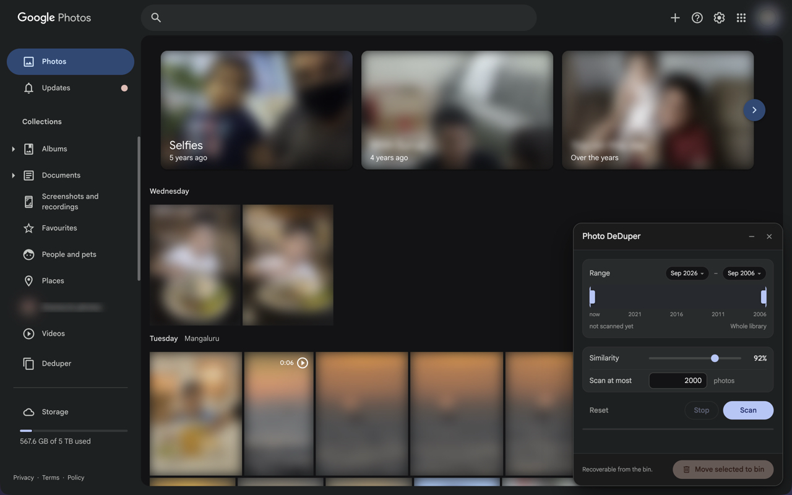
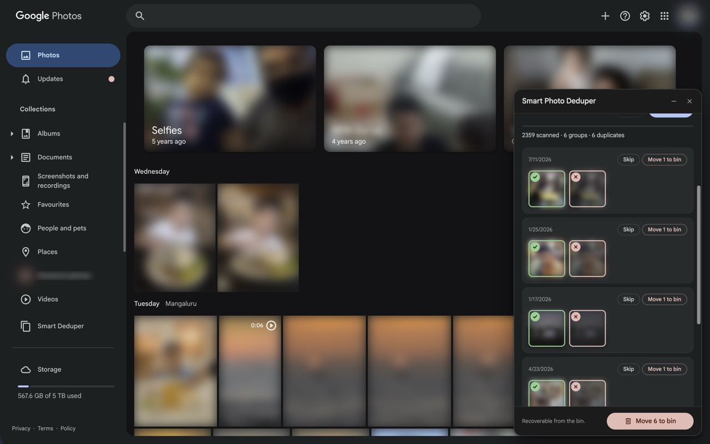
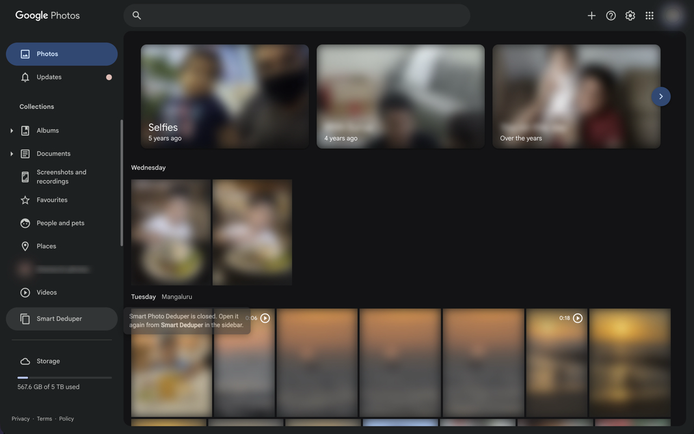

# Smart Photo Deduper

A Chrome extension that finds duplicate photos in the Google Photos library of
whoever is signed in and moves the ones you choose to the bin. It matches what a
photo *looks* like, not its filename or its bytes, so the copy that was
re-saved, re-compressed, resized or shared through a chat app still lands in the
same group as the original.

https://github.com/user-attachments/assets/f9fbfabf-f5fb-437f-96cc-33a5c77a3cf7

## Features

- **Sees past the file** — every photo is reduced to a 64-bit perceptual
  fingerprint of its thumbnail, so an edited, resized or recompressed copy is
  still recognised as the same picture. Filenames, dates and file sizes are
  never what it matches on.
- **Tunable** — one similarity slider, 70% to 100%. At 100% only near-identical
  copies group together; ease it down to catch crops, re-saves and
  recompressions of the same shot, and the results regroup as you drag.
- **Picks a keeper for you** — each group arrives with the oldest photo, the
  likely original, already marked to keep and the rest marked for the bin. One
  click moves the keeper somewhere else; nothing is decided for you.
- **Remembers what it has seen** — fingerprints live in a local IndexedDB, so a
  library is scanned once. A later scan costs only the new photos, and changing
  the similarity regroups what is already there instantly.
- **Scales** — built for libraries in the tens of thousands. Photos are listed
  and hashed in bulk in the background through the page's own API, so there is
  no scrolling and the tab does not need to stay visible.
- **Stays in your browser** — no server, no account, no analytics. The
  fingerprints and every decision you make never leave the machine.
- **Recoverable** — deleting moves photos to the Google Photos bin, where they
  stay for 60 days, and Undo puts the last run straight back.

Independent: not made by, endorsed by, or affiliated with Google. Listing copy
is in [STORE.md](STORE.md); build the upload zip with `tools/package.sh`.



_The panel before a scan: pick a date range and a similarity, then scan._



_Each group is one set of duplicates. The green ring is the keeper; every other
photo in the group is marked for the bin, and Skip leaves the whole group alone._


_Hovering a thumbnail shows it large with its capture time, so two near-identical
shots can be told apart before either is deleted._



_Closing the panel keeps it closed. It opens again from **Smart Deduper** in Google
Photos' own sidebar, which is where the note points._

_Photos are blurred in every screenshot here — a real library is somebody's
family, so `src/dev-shot.js` blurs the page before anything is captured._

## Why it works this way

The Google Photos Library API has **no delete method** — `mediaItems` exposes
list/get/search/batchCreate/patch, and `albums.batchRemoveMediaItems` only
unlinks items from an album your own app created. So any deduper has to drive
the photos.google.com UI. Everything below was verified against the live site.

| What             | Finding                                                                                                                                                                                                                                                                              |
| ---------------- | ------------------------------------------------------------------------------------------------------------------------------------------------------------------------------------------------------------------------------------------------------------------------------------ |
| Listing          | the page's own timeline RPC (`lcxiM`) returns 500 items per request, newest first, with media key, dedup key, capture time, dimensions and a thumbnail base URL; a timestamp argument starts the listing at that date                                                                |
| Thumbnail pixels | readable by a **credentialed** fetch from the content script (`credentials: "include"`, ~1.2KB at 32px). `crossOrigin="anonymous"` gets a transparent placeholder and a cookieless service-worker fetch gets a sign-in page, which is what the earlier "not readable" verdict tested |
| Deletion         | the page's own `batchexecute` RPC (`XwAOJf`), which takes each photo's dedup key rather than the `/photo/<id>` media key; the media-info RPC (`VrseUb`) maps one to the other                                                                                                        |
| Input            | **scripted clicks are ignored** — `.click()` and full synthetic pointer/mouse sequences both fail, including on the always-visible "Clear selection" button, so nothing is ever driven through the page's own UI                                                                     |

Scanning never touches the grid: the library is listed through the same
`batchexecute` RPC the page uses to fill its timeline, 500 items a request, and
each item's thumbnail is fetched at 32px with the session cookies and hashed
(dHash, 64-bit) in the content script. No scrolling, no screenshots, and the tab
does not need to be visible. The server spends ~250–600ms resizing each
thumbnail whatever the concurrency, so throughput is bounded by how many
requests are in flight: ~150 photos/s at 128, or roughly 25 minutes for 200k.

Deletion sends the same request Google Photos sends when you click "Move to
bin", from the content script with the page's own session: up to 250 photos per
request, and the reply names each photo it binned, which is what the extension
counts. It is pinned to Google's private protocol; the request shapes come from
[xob0t/Google-Photos-Toolkit](https://github.com/xob0t/Google-Photos-Toolkit)
(MIT), which has shipped the same ones since 2024. If the shape ever changes the
result is a skipped photo, never a wrongly binned one.

## Install

Unpacked, until the Chrome Web Store listing is live.

1. `chrome://extensions` → enable **Developer mode**
2. **Load unpacked** → select this folder
3. Open <https://photos.google.com>. Show or hide the panel from **Smart Deduper** in
   the sidebar, below Bin, or from the extension's toolbar icon.

## First run — do this before pointing it at anything large

Verified end to end on a live album: scan and a real delete. Still worth
walking through in this order on anything you have not scanned before:

1. Narrow the **Range** to a month or two, set **Scan at most** to `50`, Scan.
2. Check the panel reports a sane number of groups. Spot-check that the photos
   inside a group really do look alike.
3. Let it do one live delete on a single group, then check the Bin.

Only then raise the cap.

## Use

1. **Scan** — walks the library newest first within the **Range**, hashing as
   it goes. Photos already hashed are skipped, so a second scan only costs the
   new ones. Start with the default cap of 2000 rather than the whole library.
2. Adjust **Similarity** to regroup — at 100% only photos with identical
   fingerprints group together; lower values catch recompressions, crops and
   burst shots. Regrouping reads the local store, so it costs nothing.
3. Review the groups. Green is the keeper (oldest by default). Click a photo to
   make it the group's keeper; click the badge on a thumbnail to flip that
   single item between keep and bin.
   **Hover a thumbnail** to see the photo large (up to 1200px) with its capture
   time, so you can tell two near-identical shots apart before deleting one. The
   preview works because the thumbnail URL's size segment is rewritable —
   `=w192-h192-no` becomes `=w1200-h1200-no` and returns a genuinely larger
   image rather than an upscale.

   The minimise button collapses the panel to its title bar. The close button
   next to it hides the panel and keeps it hidden across reloads — a note by the
   sidebar says so — until **Smart Deduper** in the sidebar opens it again.

4. **Move selected to bin** — click it twice (the button arms itself for fifteen
   seconds rather than opening a dialog; a content script's native `confirm()`
   blocks the whole renderer). It bins 250 photos per request and only counts a
   photo once Google's reply names it. Items land in the Google Photos bin and
   stay recoverable there for 60 days. Anything not confirmed stays selected,
   so clicking again carries on.

**Scope** is the whole library, whichever view is open: the listing RPC walks
the timeline regardless of the grid, and archive is left out. The **Range**
slider and **Scan at most** are the two ways to narrow a pass; the sparkline
under the slider shows what has been scanned already. A first full pass on a
~100k-photo library is around a quarter of an hour.

## Layout

Plain content scripts, no build step; `manifest.json` lists them in load order
and each registers itself on `window.GPDD`.

- `src/lib/` — no DOM: `store` (IndexedDB), `hash` (dHash), `grouping`,
  `api` (batchexecute calls: bin, restore, media info), `scanner` (listing plus
  thumbnail hashing). Nothing reads the photo grid: every fact the extension
  needs comes from the same RPCs the page itself calls.
- `src/ui/` — the panel, one component per file under `window.GPDD.ui`:
  `styles` (design tokens and the shared chrome, controls and buttons) and
  `icons` (inline SVG), `range` (month slider), `preview` (the hover preview),
  `results` (group cards, paging, selection), `panel` (template, `mount()`,
  status setters), `nav` (the Smart Deduper entry in Google Photos' sidebar).
  Each of `range`, `preview` and `results` carries its own markup and CSS next
  to its code; `panel` concatenates the four stylesheets.
- `src/content.js` — wiring: state, the scan, delete and undo flows, each
  bracketed by the same run lock.
- `src/background.js` — extension reload and the toolbar button only.
- `src/dev-reload.js`, `src/dev-shot.js` — development only, dropped from the
  packaged zip by `tools/package.sh`.

## Reloading during development

Chrome only picks up edits to an unpacked extension after a reload on
`chrome://extensions`, which no script on a page can reach. As a shortcut, the
content script listens for a page event that asks the service worker to restart
itself:

```js
document.dispatchEvent(new Event("gpdd-reload"));
```

Run that in DevTools on a Google Photos tab, then reload the page. It restarts
this extension and nothing else.

To have that happen on every save, run `tools/dev-serve.py` and reload the
extension once; the tab then restarts the extension and reloads itself
whenever anything under `src/` or `manifest.json` changes.

## Limits

- Hashes a 32px thumbnail, not the original file, so it finds visual duplicates
  rather than proving byte-identity.
- Throughput is measured, and recorded on each run under the `lastScan` meta
  row. The server takes ~250–600ms per thumbnail whatever the size, so the rate
  is set by how many requests are in flight: ~100 photos/s at 64, ~150/s at
  128, and worse again at 256. 10,000 photos ran in 96s at 64.
- Memory is not the limit: rows are ~309 bytes each (59MB at 200k), reading the
  whole store takes about a second at that size, and the set of known ids is
  24MB. Grouping 200k photos is ~800M hash comparisons and takes ~4.8s, yielded
  every 4M so the page keeps responding (worst block 31ms).
- Results are shown a page of 200 groups at a time, and only what has been shown
  is selected for deletion, so the count on the bin button is always what is on
  screen.
- Filename-based matching would need the info panel opened per photo — one page
  load each. Not viable at library scale, so it is not implemented.
- Stored thumbnail URLs are a stable per-photo token plus a size suffix
  (`.../pw/AP1Gcz...=w192-h192-no`); only the suffix changes between sessions, so
  they do not rot the way a signed URL would. A thumbnail that fails to load
  shows an empty frame and a count rather than a broken-image glyph.
- Videos are always excluded. A video's hash can only come from its poster
  frame - the still Google shows in the grid - so a match means one frame
  looked alike, which is not enough to bin a clip on. Measured on a real
  library: 135 videos produced 0 exact and 1 near match.

## Credits

The private `batchexecute` request shapes — the timeline listing (`lcxiM`),
media info (`VrseUb`), the bin listing (`zy0IHe`) and the trash/restore call
(`XwAOJf`) — come from
[xob0t/Google-Photos-Toolkit](https://github.com/xob0t/Google-Photos-Toolkit)
(MIT), which reverse-engineered and has maintained them since 2024. This
extension would have needed the same months of traffic capture without it.

## Privacy

Nothing is collected and nothing leaves the browser; fingerprints live in
IndexedDB on your own machine. Full text: [PRIVACY.md](PRIVACY.md), published at
<https://nvkudva.github.io/smart-photo-deduper/>.

## Disclaimer

This extension is provided as is, with no warranty of any kind. It deletes
photos from a real Google account, and the developer accepts no responsibility
for any data loss, however caused. Deletes are recoverable from the Google
Photos bin for 60 days — check that a run did what you expected before that
window closes. Use it at your own risk.
